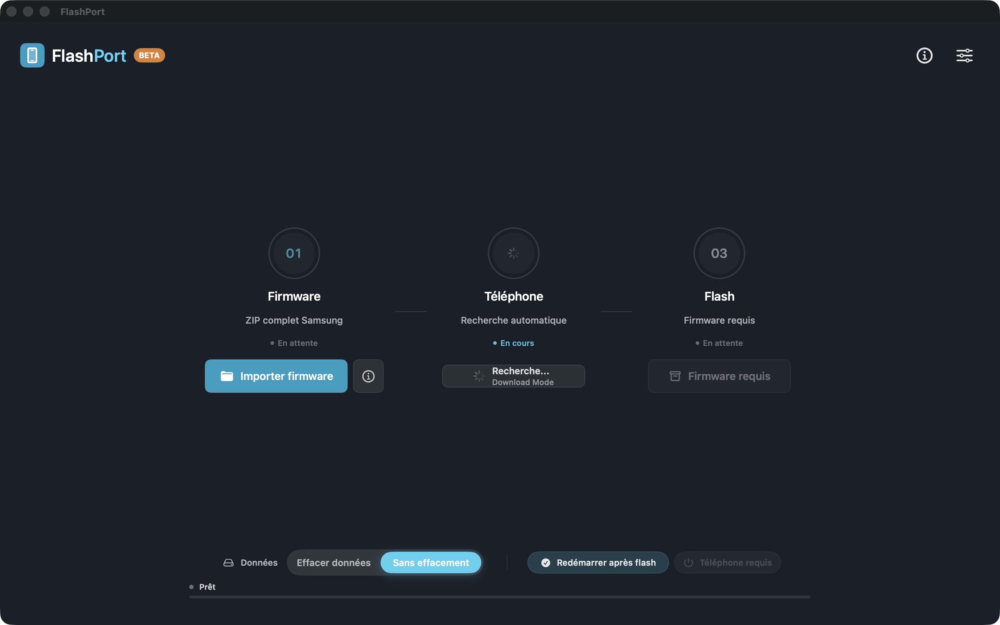

# FlashPort

**Application macOS native pour flasher des firmwares Samsung en mode Download — une alternative à Odin pour Mac.**

FlashPort importe les packages firmware Samsung officiels (ZIP ou dossier extrait), associe les images BL/AP/CP/CSC à la table de partitions PIT du téléphone, et les flashe par USB — avec conservation des données, exactement comme le mode HOME_CSC d'Odin.

*An English version is available below: [English version](#english-version).*

---

## ⚠️ Avertissement

Flasher un firmware peut endommager définitivement un téléphone si le firmware, le modèle ou la région sont incorrects. **Utilisez uniquement un firmware officiel correspondant exactement au modèle Samsung (ex. SM-A137F) et à la région.** Vous utilisez ce logiciel à vos risques et périls. Ne commitez et ne redistribuez jamais de fichiers firmware Samsung.

## Fonctionnalités

- **Moteur du protocole Odin natif en Swift** — handshake, lecture PIT, gestion de session, séquences de transfert. Gère les images de **plus de 4 Go** (tailles 64 bits), que Heimdall 1.4.2 tronque silencieusement.
- **Flash avec conservation des données** — respecte le `meta-data/download-list.txt` du package comme Odin : avec HOME_CSC, les images `misc.bin`, `param.bin`, `md_udc.img` et `userdata.img` sont automatiquement exclues pour préserver les données utilisateur.
- **Garde-fous firmware** — vérification du code modèle et du binary bootloader (rev) depuis les noms d'archives, blocage anti-downgrade, détection des doublons de partition.
- **Détection automatique** du téléphone en mode Download (VID Samsung `0x04E8`).
- **Décompression LZ4** — via le binaire `lz4` s'il est installé, sinon décodeur Swift intégré.
- **Backend Heimdall optionnel** pour les configurations où il fonctionne bien (voir limites ci-dessous).
- Console de logs en direct, export de rapport de session, export PIT, historique des flashs.

## Prérequis

- macOS 14.6 ou plus récent.
- Xcode 16+ pour compiler.
- Optionnel : [Heimdall](https://glassechidna.com.au/heimdall/) (`brew install heimdall`) pour le backend Heimdall optionnel (secours).

## Utilisation

1. Mettez le téléphone Samsung en mode Download (Vol + et Vol − câble USB branché, puis Vol + pour confirmer).
2. Ouvrez FlashPort — le téléphone est détecté automatiquement.
3. Importez le ZIP firmware complet (ex. depuis SamFW/Frija) ou un dossier extrait.
4. Choisissez le mode de données :
   - **Effacer données** — utilise le CSC, inclut `userdata`.
   - **Sans effacement** — utilise le HOME_CSC et la download-list du package.
5. Flashez. Le PIT est lu automatiquement quand nécessaire ; les images de plus de 4 Go (`super`) passent par le moteur Swift natif.
6. Le premier démarrage après un flash peut prendre plusieurs minutes.

## Backends et limites connues

| Backend | Notes |
|---|---|
| Moteur Swift natif (par défaut) | Validé de bout en bout sur matériel réel (Galaxy A13 SM-A137F, MediaTek). Tailles 64 bits, délais de finalisation étendus après les grosses images, flash en session unique. Utilise le transfert USB bulk (IOUSBHost) quand macOS l'autorise, repli port série sinon (lent). |
| Heimdall 1.4.2 | Rapide, mais **tronque les fichiers de plus de 4 Go** et les sessions `--resume` enchaînées sont peu fiables sur les bootloaders récents. FlashPort bascule automatiquement sur le moteur natif quand c'est nécessaire. |

Heimdall n'est **pas** fourni. FlashPort le cherche dans le bundle de l'app, le `$PATH`, les emplacements Homebrew/MacPorts et les installations Heimdall Suite.

## Développement

Ouvrez `FlashPort.xcodeproj` et compilez le schéma `FlashPort`. Les tests unitaires couvrent le parsing/sérialisation PIT, la structure des paquets Odin, la lecture TAR/`.tar.md5` (y compris les tailles GNU base-256), le décodage LZ4, le mapping firmware↔PIT, le filtrage download-list et la génération des commandes Heimdall.

## Changelog

L'historique des versions est détaillé dans le [CHANGELOG](CHANGELOG.md).

## Licence

[MIT](LICENSE). L'implémentation du protocole Odin s'appuie sur le protocole documenté par le projet open source [Heimdall](https://github.com/Benjamin-Dobell/Heimdall) (MIT).

---

## English version

**FlashPort is a native macOS app for flashing Samsung firmware in Download Mode — an Odin alternative for Mac.**

FlashPort imports official Samsung firmware packages (ZIP or extracted folder), maps the BL/AP/CP/CSC images against the device's PIT partition table, and flashes them over USB — with data preservation support, exactly like Odin's HOME_CSC workflow.

### ⚠️ Disclaimer

Flashing firmware can permanently damage a device if the firmware, model, or region is wrong. **Use only official firmware matching the exact Samsung model (e.g. SM-A137F) and region.** You use this software at your own risk. Never commit or redistribute Samsung firmware files.

### Features

- **Native Odin protocol engine written in Swift** — handshake, PIT read, session management, file transfer sequences. Handles images **larger than 4 GB** (64-bit sizes), which Heimdall 1.4.2 silently truncates.
- **Data-preserving flash** — honors the package's `meta-data/download-list.txt` like Odin does: with HOME_CSC, images such as `misc.bin`, `param.bin`, `md_udc.img` and `userdata.img` are automatically excluded so user data survives the flash.
- **Firmware safety checks** — model code and bootloader binary (rev) validation from archive names, downgrade blocking, duplicate partition detection.
- **Automatic device detection** in Download Mode (Samsung VID `0x04E8`).
- **LZ4 decompression** — native `lz4` CLI when available, pure-Swift fallback decoder otherwise.
- **Optional Heimdall backend** for devices/setups where it works well.
- Live log console, session report export, PIT export, flash history.

### Requirements

- macOS 14.6 or later.
- Xcode 16+ to build.
- Optional: [Heimdall](https://glassechidna.com.au/heimdall/) (`brew install heimdall`) for the optional Heimdall fallback backend.

### Basic workflow

1. Put the Samsung device in Download Mode (Vol Up + Vol Down with USB cable plugged in, then Vol Up).
2. Open FlashPort — the device is detected automatically.
3. Import the full firmware ZIP (e.g. from SamFW/Frija) or an extracted folder.
4. Choose the data mode: **Effacer données** (wipe, uses CSC) or **Sans effacement** (preserve data, uses HOME_CSC and the package's download-list).
5. Flash. The PIT is read automatically when needed; images over 4 GB (`super`) are flashed by the native Swift engine.
6. First boot after a flash can take several minutes.

### Backends and known limits

| Backend | Notes |
|---|---|
| Native Swift engine (default) | Validated end-to-end on real hardware (Galaxy A13 SM-A137F, MediaTek). 64-bit file sizes, long finalization timeouts after large images, single-session flashing. Uses IOUSBHost bulk transfer when macOS allows it, serial fallback otherwise (slow). |
| Heimdall 1.4.2 | Fast, but **truncates files larger than 4 GB** and chained `--resume` sessions are unreliable on recent bootloaders. FlashPort automatically switches to the native engine when needed. |

Heimdall is **not** bundled. FlashPort looks for it in the app bundle, `$PATH`, Homebrew/MacPorts locations, and Heimdall Suite installs.

### Development

Open `FlashPort.xcodeproj` and build the `FlashPort` scheme. Unit tests cover PIT parsing/serialization, Odin packet layout, TAR/`.tar.md5` reading (including GNU base-256 sizes), LZ4 decoding, firmware↔PIT mapping, download-list filtering, and Heimdall command generation.

### License

[MIT](LICENSE). The Odin protocol implementation is based on the publicly documented protocol from the open-source [Heimdall](https://github.com/Benjamin-Dobell/Heimdall) project (MIT).
